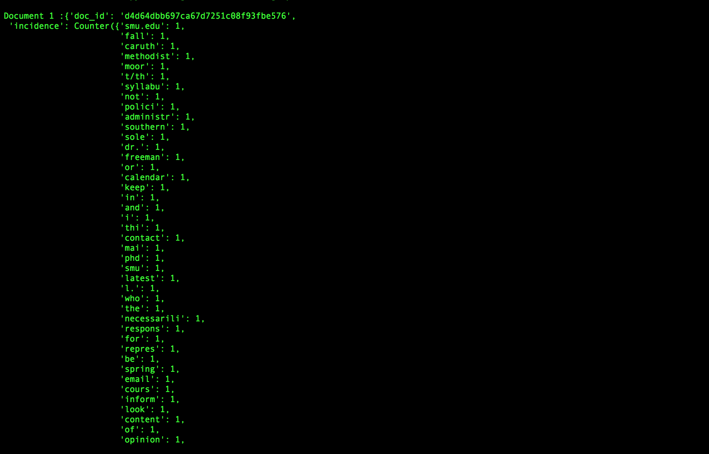
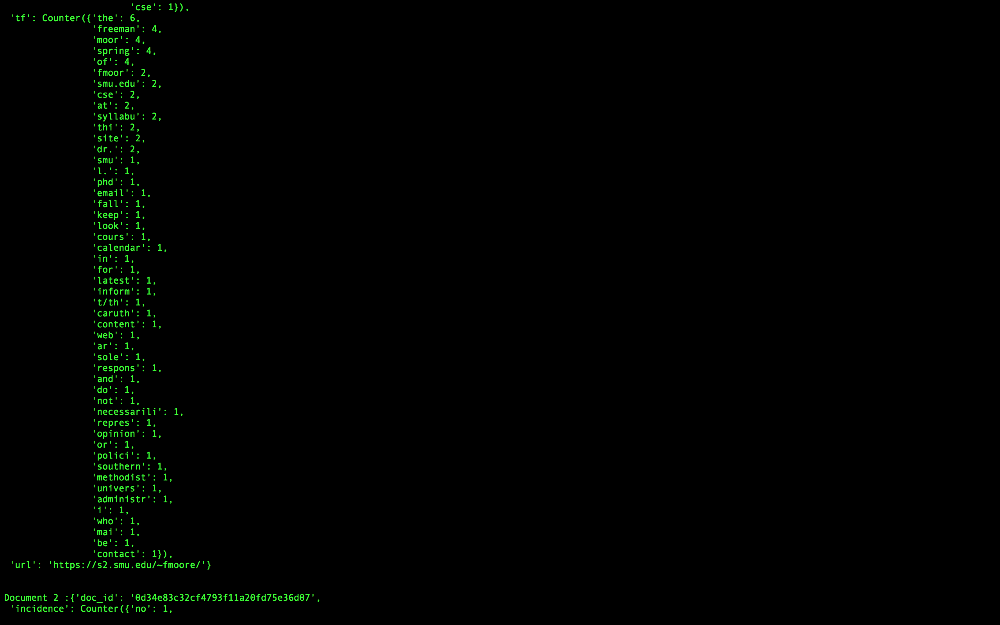
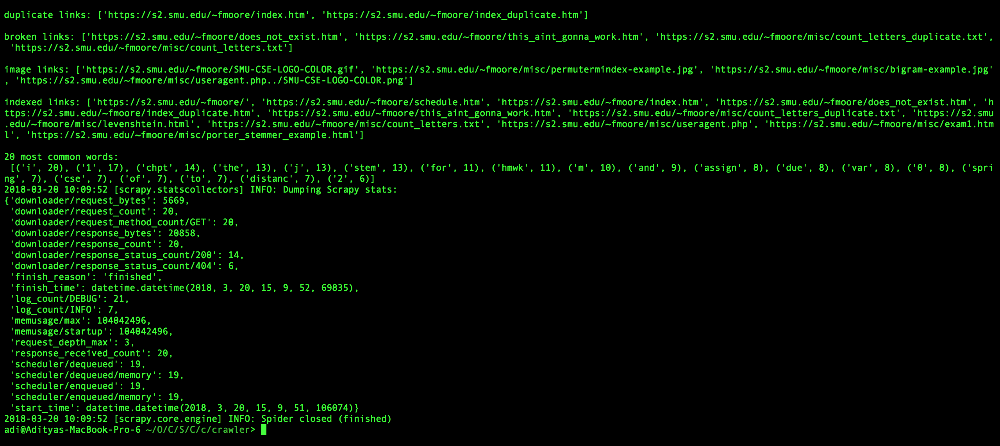

To-dos
✔ List all URLs
✔ Contents of <TITLE> 
✔ Duplicate detection, report duplicate page URLs
✔ List URLs of graphic files
✔ tf-df with stemming
✔ 20 most common words
CSE7337, Aditya Rao (47221503)

This project requires the following python packages to be installed:
scrapy
beautifulsoup4
nltk
pandas
numpy
scipy

After navigating to the crawler directory, run

> scrapy crawl crawly

where crawly is the name of this crawler

* Most of the outputs (duplicates, indexed URLs, parsed documents, URL of graphic files, 20 most common words)
  are printed in the log.

* On successful run, the spider will also generate tf-df.csv in this directory, which contains all the
  term and document frequencies of parsed documents.

* Data Structures:
- The different link stats (broken urls, links of duplicates, graphic file links, indexed links)
 are all stored in lists
- The words along with their counts are stored as key-value pairs 
  in a Counter (a Dictionary-based implementation in Python)
- A dictionary is used to store page response signatures (fingerprints) and their urls as key-value pairs respectively.
  A page with the same text will have the same signature, and hence will be a duplicate. This is output in the logs.
- Details of a parsed page are recorded and stored as a Document, which is a dictionary that holds values of
  url, term-incidence, term-frequency and the doc-id (signature/fingerprint).

* Search-engine:
- To run the search engine, navigate to this directory and run
> python3 search_engine.py

- The search engine requires thesaurus.csv (present), tf-df.csv (the file that contains term and doc frequencies)
  and title-preview.csv (the file that contains details for all scraped documents).
  tf-df.csv and title-preview.csv are generated by the crawler every time it's run.

- The search engine displays all the instructions required. In order to quit, type in 'quit' when
  prompted for a query.

